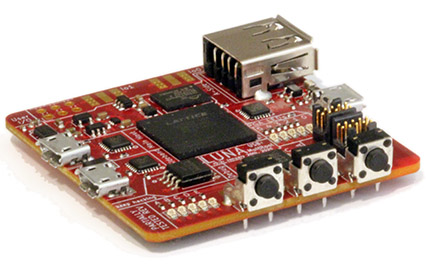

========================================
LUNA: USB Multitool and Gateware Library
========================================

This is the documentation for the LUNA gateware library; and the developer document for the LUNA
USB multitool hardware and software.

Much like the LUNA hardware, gateware, and software, this documentation is a work in progress.
Contributions are always appreciated.

.. toctree::
   :maxdepth: 2
   :caption: Contents:

   intro
   features
   getting_started
   custom_hardware
   gateware/usb2_device
   gateware/endpoint
   hardware/bringup_guide

Generated indices
==================

* :ref:`genindex`
* :ref:`modindex`
* :ref:`search`
