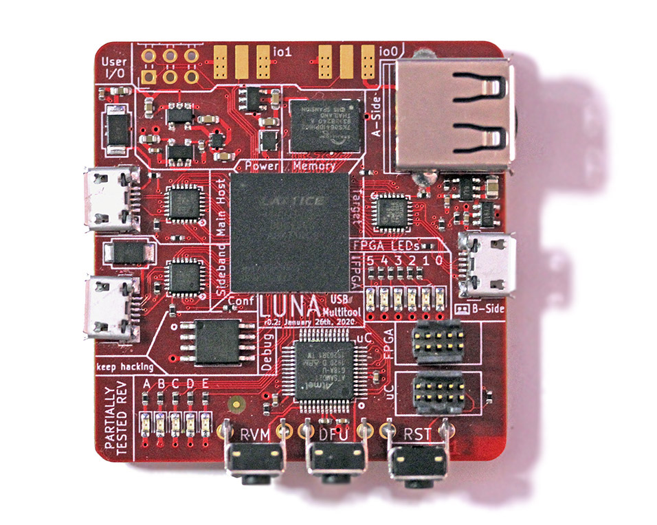

============
Introduction
============

	*Note: LUNA is still a work in progress; and while much of the technology is in a usable state,
	much of its feature-set is still being built. Consider LUNA an 'unstable' library, for the time being.*

Welcome to the LUNA project! LUNA is a full toolkit for working with USB using FPGA technology; and provides
hardware, gateware, and software to enable USB applications.

..

Some things you can use LUNA for, currently:

- **Protocol analysis for Low, Full or High speed USB.** LUNA provides both hardware designs and gateware that
  allow passive USB monitoring. When combined with the `ViewSB <https://github.com/usb-tools/viewsb>`__ USB analyzer
  toolkit, LUNA hardware+gateware can be used as a full-featured USB analyzer.
- **Creating your own Low, Full or High speed USB device.** LUNA provides a collection of Amaranth gateware that
  allows you to easily create USB devices in gateware, software, or a combination of the two.
- **Building USB functionality into a new or existing System-on-a-Chip (SoC).** LUNA is capable of generating custom
  peripherals targeting the common Wishbone bus; allowing it to easily be integrated into SoC designs; and the library
  provides simple automation for developing simple SoC designs.

Some things you'll be able to use LUNA for in the future:

- **Man-in-the-middle'ing USB communications.** The LUNA toolkit will be able to act
  as a *USB proxy*, transparently modifying USB data as it flows between a host and a device.
- **USB reverse engineering and security research.** The LUNA toolkit will serve as an ideal
  backend for tools like `FaceDancer <https://github.com/usb-tools/facedancer>`__; allowing easily
  emulation and rapid prototyping of compliant and non-compliant USB devices.

More detail on these features is covered in `the source <https://github.com/greatscottgadgets/luna>`__, and in
the remainder of this documentation.
